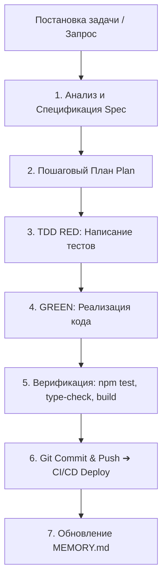

# Стратегия поддержки и развития платформы Alanya Holidays

> **Статус платформы:** Зрелый production-ready монорепозиторий (~915+ автоматических тестов, React 19, NestJS 10, Supabase PostgreSQL, Redis, Docker, CI/CD).

---

## 🏛️ 1. Архитектурная дисциплина и защита границ (Architecture Guardrails)

### Принцип Чистой Архитектуры (Clean Architecture)
- **Frontend Layering:**
  - UI-компоненты (`frontend/src/pages/`, `frontend/src/components/`) **никогда не импортируют** SDK базы данных (Supabase client, ORM) напрямую.
  - Все операции с данными проходят через фасадные и специализированные доменные сервисы в [`frontend/src/api-services/`](file:///Users/ruslannazarov/Development/alanya-holidays/frontend/src/api-services/) и клиент [`frontend/src/lib/api-client.ts`](file:///Users/ruslannazarov/Development/alanya-holidays/frontend/src/lib/api-client.ts).
  - Это обеспечивает независимость UI от структуры БД, возможность офлайн-фоллбеков и безопасное мокирование.
- **Backend Layering:**
  - Строгое разделение слоев: `presentation/` (контроллеры, DTO) ➔ `application/` (сервисы бизнес-логики) ➔ `domain/` (сущности, Value Objects, интерфейсы репозиториев) ➔ `infrastructure/` (реализация доступа к БД, Redis, внешним API).
  - Инварианты предметной области инкапсулируются в сущности и неизменяемые Value Objects (например, `StayPeriod`, `Money`, `ReviewRating`).

### Абсолютный запрет на ослабление типов
- **Запрещены:** типы `any`, `@ts-ignore`, `@ts-nocheck`.
- В CI пайплайне настроен строгий линтинг с флагом `--max-warnings=0`.

### Синхронизация графа знаний и AST-навигация (Graphify & Serena)
- Поддержание карты зависимостей проекта через `graphify update .` после крупных изменений.
- Использование семантических инструментов Serena MCP для поиска символов и безопасного рефакторинга без засорения контекста.

---

## 🛡️ 2. Процесс разработки и защита от регрессий (TDD & Quality Assurance)

### Протокол Red-Green-Refactor (TDD)
1. **RED:** Перед написанием любого функционального кода или фикса пишется падающий тест, воспроизводящий задачу или баг.
2. **GREEN:** Пишется минимально достаточный чистый код для прохождения теста.
3. **REFACTOR:** Проводится улучшение структуры кода, очистка типов и оптимизация без изменения внешнего контракта.

### Мультиагентный процесс (Teamwork & Sentinel Victory Audit)
- Для сложных задач и объемных рефакторингов используется команда субагентов (реализатор ➔ 3 раунда перекрестного ревью ➔ независимый аудитор).

### Persistent Memory Bank
- Все ключевые архитектурные решения (ADR), решенные инциденты и вехи фиксируются в [`.agents/MEMORY.md`](file:///Users/ruslannazarov/Development/alanya-holidays/.agents/MEMORY.md).

---

## 📊 3. Эксплуатация, мониторинг и телеметрия в проде (Production Observability)

1. **Error Tracking (Sentry):**
   - Подключение Sentry на фронтенде (React ErrorBoundary) и бэкенде (Global Exception Filter).
   - Моментальные алерты с полным стектрейсом, окружением и контекстом пользователя.
2. **Healthchecks & Uptime Monitoring (Uptime Kuma):**
   - Непрерывный мониторинг доступности платформы (`/api/health`, `https://alanyaholidays.com`) с отправкой уведомлений в Telegram.
3. **Structured JSON Logging & Traceability:**
   - Сквозной `x-request-id` для трассировки цепочки запросов `Frontend ➔ Nginx ➔ NestJS API ➔ Supabase`.

---

## 💾 4. Надежность данных и резервное копирование (Database Ops & Backups)

- **Автоматизированные бэкапы PostgreSQL:**
  - Ночной cron-скрипт с созданием дампов `pg_dump`, шифрованием и выгрузкой в S3 / Cloudflare R2.
  - Retention policy: хранение 7 ежедневных дампов + 4 еженедельных архивов.
  - Регулярная проверка восстановления данных (Disaster Recovery Drill).
- **Дисциплина миграций:**
  - Изменение структуры БД только через версионированные SQL-файлы в [`supabase/migrations/`](file:///Users/ruslannazarov/Development/alanya-holidays/supabase/migrations/).
  - Строгие проверки RLS (Row Level Security) и `SECURITY DEFINER` функций (`SET search_path = public`).

---

## 🎯 5. Roadmap дальнейшего развития и приоритеты

| Приоритет | Направление | Задачи | Цель / Результат |
|---|---|---|---|
| 🟡 **Высокий** | **Бизнес-логика** | **Milestone 15: Доменная модель корзины и чекаута** | Value Object `Money`, мультивалютность (TRY/EUR/USD), идемпотентность платежей |
| 🟡 **Высокий** | **Инфраструктура** | **Автоматические бэкапы БД в S3/R2** | Полная сохранность данных пользователей, отзывов и каталога |
| 🟢 **Средний** | **Телеметрия** | **Интеграция Sentry & Healthcheck алертов** | Проактивное обнаружение ошибок до обращений клиентов |
| 🟢 **Средний** | **Автотесты** | **E2E Smoke тесты (Playwright)** | Автоматическая проверка сквозных пользовательских сценариев в CI |

---

## 💡 Стандартный рабочий цикл для любых задач

